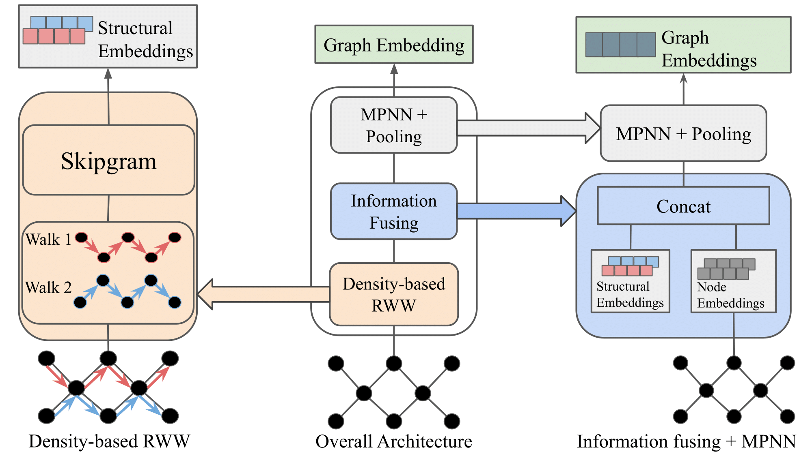

# DECODE: DEnsity-aware Walks for COordinated Campaign DEtection

## Overview

Our work focuses on detecting ephemeral astroturfing, a tactic where bots rapidly promote a topic to trend before deleting their tweets to erase traces. We propose a random weighted walk (RWW) approach where node transitions are biased by local density measures such as degree, core number, or truss number. Our model framework is given below.




Our model is trained on the LEN dataset, available [here](https://erdemub.github.io/large-engagement-network/). In order to get the k-truss values, use the code available in [A.E. Sariyuce et al.](https://sariyuce.com/codes/nucleus_master.zip).

## Environmental setup

To install the required packages, use the following command:
```
pip install -r requirements.txt
```

## Obtaining random weighted walks

An example script to obtain the embeddings from the random weighted walk is given below. In this example, we use degree-based random weighted walk and set the threshold to 0.5.
```
python3 ../kcore_rww.py --path ./all_graphs --graphId 1 --pick degree --comp 0.5
```
We provide a bash script for each density metric: [degree](./run/degree), [core](./run/core) and [truss](./run/truss). The file is called `gen_rww.sh`.

## Running models

An example script to train the model is given below. In this example, we train the model on node embeddings + degree-based embeddings for the binary classificatioin task.

```
python3 train_twitter_MPNN.py --model GCN --data_type all  --hidden_dim 128 --lr 0.0001 --output_dim 2 --small_graphs_path ./small_graphs --all_graphs_path ./all_graphs --multivariate 0 --rww_attr degree --node_attr 1
```
We provide a bunch of examples for binary classification and multiclass classification tasks across all the density metric: [degree](./run/degree), [core](./run/core) and [truss](./run/truss). The files are called `binary.sh` and `multiclass.sh` respectively.

## References
Sariyüce, A. E., Seshadhri, C., Pinar, A., & Çatalyürek, Ü. V. (2017). Nucleus decompositions for identifying hierarchy of dense subgraphs. ACM Transactions on the Web (TWEB), 11(3), 1-27.
